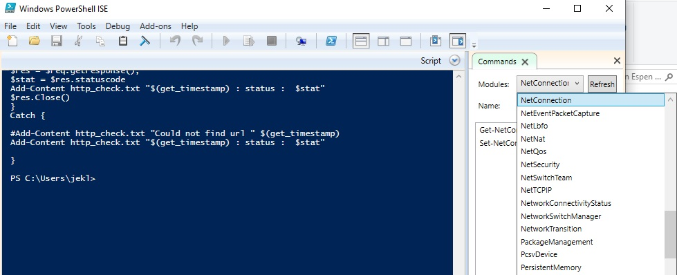

## POWERSHELL

#### Using the PowerShell ISE is the preferred way to work with the scripting language, because it provides syntax highlighting, auto-filling of commands and other automation features that simplify script development and testing.

View modules


#### PowerShell scripts are stored in.ps1 files. 
#### In addition, there is policy that restricts script execution. You can check this policy by running the Get-ExecutionPolicy command in PowerShell:
```ps1
Get-ExecutionPolicy
```

* Restricted— No scripts are allowed. This is the default setting, so you will see it the first time you run the command.
* AllSigned— You can run scripts signed by a trusted developer. With this setting in place, before executing, a script will ask you to confirm that you want to run it.
* RemoteSigned— You can run your own scripts or scripts signed by a trusted developer.
* Unrestricted— You can run any script you want.

#### To start working with ps1
```ps1 
Set-ExecutionPolicy RemoteSigned
```

### Cmdlets
#### A cmdlet is a PowerShell command with a predefined function, similar to an operator in a programming language, A cmdlet always consists of a verb (or a word that functions as a verb) and a noun, separated with a hyphen (the “verb-noun” rule). For example, some of the verbs include:

* Get — To get something
* Set — To define something
* Start — To run something
* Stop — To stop something that is running
* Out — To output something
* New — To create something (“new” is not a verb, of course, but it functions as one)

#### Good news — you don’t need to memorize all cmdlets. You can list all cmdlets by executing the Get-Help -Category cmdlet
```ps1
Get-Help
```
#### Parameter
```ps1
Get-Service -Name W*
```
#### If you forget a cmdlet’s parameters, just use a script like the following, which will display the parameters for the Get-Process cmdlet:
```ps1
Get-Process | Get-Member
```
#### If you still don’t find the cmdlet you need, you can make sure the help is current and then get examples for a cmdlet
```ps1
Update-Help #to update the help data
Get-Help Get-Process -Examples
```
#### Pipes
#### A pipe passes data from one cmdlet to another
#### For example, if you execute the following script, you’ll get all services sorted by their status:
```ps1
Get-Service | Sort-Object -property Status
# output dir to text
"ftft" | Out-File out.txt
```


## CMD
Uptime:
``` CMD
systeminfo | find "System Boot Time"
```
Copy:
``` CMD
REM /e copy subfolders including empty
REM /r:0  Number of retries (default:1000000)
REM /w:o wait time between retires
REM /sec copy files with SECurity
REM /secfix fix file SECurity on all files, even skipped files
REM /timfix fix file TIMes on all files, even skipped

REM net use: connect, remove and configure connections to shared resources like mapped drives
net use z: \\WM01\f$
robocopy z:\datacatalog e:\datacatalog /e /r:0 /w:0 /sec /secfix /timfix
net use z: /del
```

## Linux

